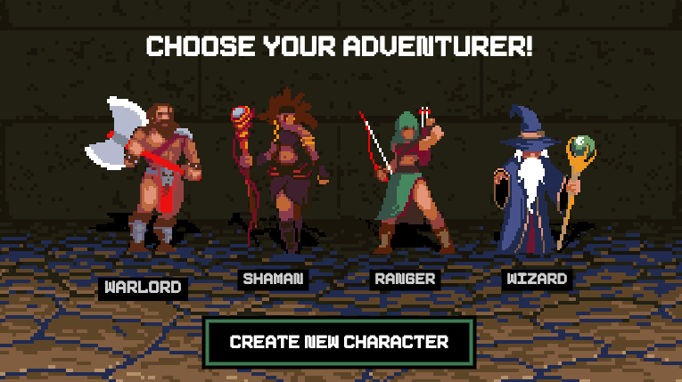

# About



Turn-based fantasy campaign game powered by Chainlink VRF and user imagination, built for the [Fall 2021 Chainlink Hackathon](https://chain.link/hackathon) in far less time than we should have allowed for! Uses zkSNARKs to validate that the user has completed the maze.

Select your adventure and navigate through Draco the Dragon's dungeon, fighting minions and collecting loot controlled the whims of Draco's magical (VRF) oracle! Once you've acquired the special weapon you can open the door to his lair and, maybe, vanquish him once and for all!

You can find a recording of the game [here](./docs/movie.mp4) if you want to see what it's like in action without running it yourself.

# How it works

See also the [Devpost page](https://devpost.com/software/fantasy-campaign) for this project.

First the user selects and mints a new character (as an NFT), then starts the campaign.

As the user progresses through the maze they will eventually hit a spawn point. The frontend then call the smart contract to ask for new (random) turn. The contract then requests a random value from the oracle (this is shown as the "Dracon consults its oracle modal")  which itself then calls the contract after a period of time, at which point the contract emits a turn event. The frontend code responds to that event and checks what type of screen to display to the user - battle or loot.

In battle mode, for each turn the user requests a random result from the contract which determines the damage to them and their enemy. Once the enemy has been defeated, the user returns to navigating a maze.

If the user has acquired the magic weapon, once they get to the door the frontend checks (using a zkSNARK verifier) that they have indeed got to that point without teleporting or working through walls. If it's valid, the door to Draco's lair is opened. As the user passes through the door, the ZKP is verified in the smart contract and if that's ok they can finally battle Draco.

# To get it running

Create a `.env` file and either copy over the values in `.env.local.template` or `.env.testnet.template` depending on which one you're using. You will also need to add `MUMBAI_RPC_URL` (e.g. `https://polygon-mumbai.infura.io/v3/asdasdasd`) and your `PRIVATE_KEY`.

```
yarn
yarn node:start
yarn contracts:deploy # in another session - only run this once
yarn web:start # in another session
```

There's a number of other commands in the package.json which hopefully should be clear what they do from their names.

# Controls

`w` - forward

`s` - backwards

`a` - strafe left

`d` - strafe left

`[` - turn left

`]` - turn right

# About the zkSNARKs

**Warning! There's a lot of stuff here that isn't good practice!**

When the user gets to the gate at the end of the maze, the snarkjs validates all their moves to get to that point to determine whether they got there legitimately and not teleporting etc (a bit like a rollup). You can see examples in the tests here: [circuits.test.ts](./circuits/circuits.test.ts).

The circuits themselves are fairly rough and don't check for common attacks but should work fine as a proof of concept. The input is also limited to just 200 steps - if the user does more than that, the validator will throw. This is to keep the performance pretty much realtime on modern computers.

The solution to the circuit is pretty easy to find in the repo (it's even in the UI itself!) but you could imagine this being omitted from the coddebase and obfuscated from the user. Furthermore since we don't enforce the proof being submitted only once in the contract, it's possible to inspect the contract transaction history on the blockchain, extract the proof and then re-submit it as a different user. But that's easy enough to defend against - for example storing the keccak256 hash of of the proof and ensuring it's only been used once. Since each generated proof is a random set of points, this hash will never be submitted again except maliciously.

For reasons above and more, many of the build artefacts that are committed to the repo shouldn't be, but they are there for interest and easy collaboration.

# Troubleshooting

Inevitable bugs from writing a game at breakneck speed in our spare time aside, 99% of the problems when running locally come down to:

- Need to reset your MetaMask wallet.
- Didn't successfully run `contracts:deploy` - probably due to a TypeScript issue where in tsconfig.json `module` needs to be `commonjs` (we should fix this!).
- The contracts were deployed twice which results in different contract addresses.
- The app's got into some weird state. Use the hidden clear storage button top right and reload the page.
- Your wallet isn't set to use the right network (e.g localhost:8545 if ran locally).
- Your wallet isn't using the local network.
- The app stays on the oracle modal. It takes about 30 seconds for the event to be emitted that clears this modal but there's a chance something else went wrong. If it doesn't clear in 30 seconds reload the page.

If you experience any other issues, let us know!

# Thanks

Thanks to [
Andrija Novakovic](https://github.com/akinovak) for their ultra fast reply in the Iden3 Telegram with some sample code for getting the prover working in the browser... but also thanks to Iden3 in general for all their work.

Thanks also to [Joe Shaw](https://www.thedevteam.co.uk/Knowledge-Base/DungeonMasterJavascript) for the inspiration for the "3D" engine as well as the anons who created the original pixel art.
